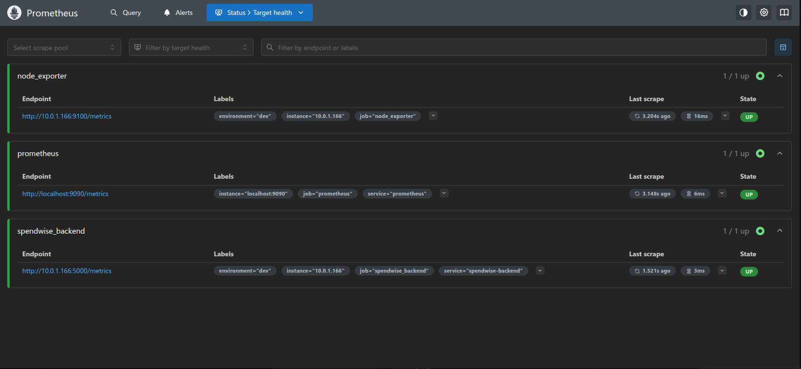
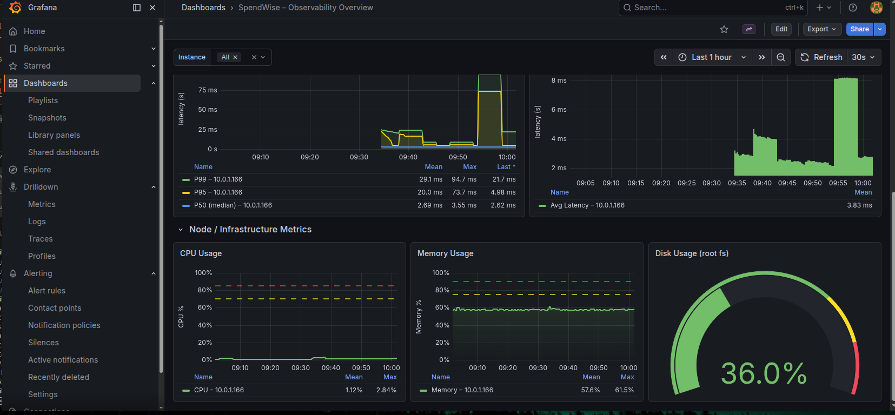
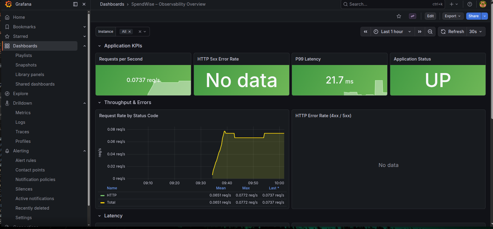
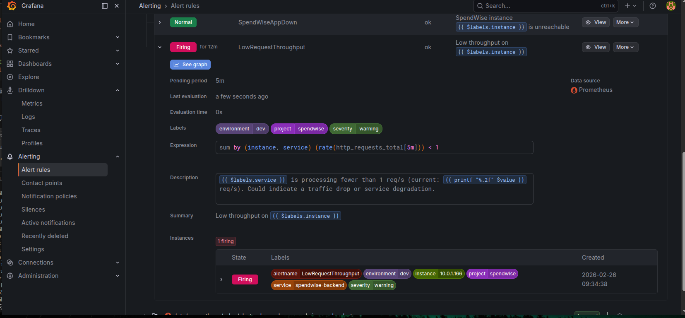
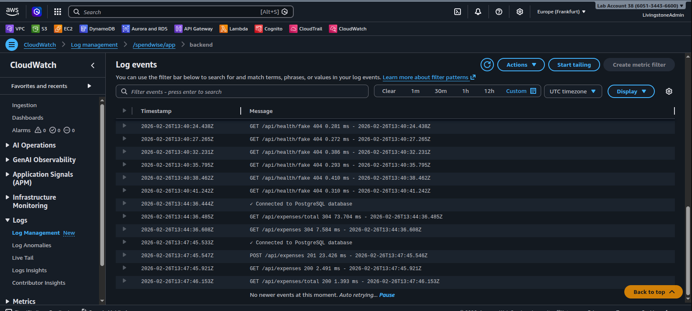
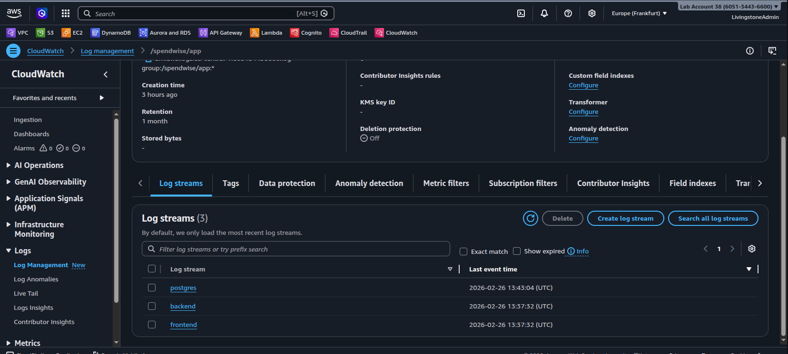
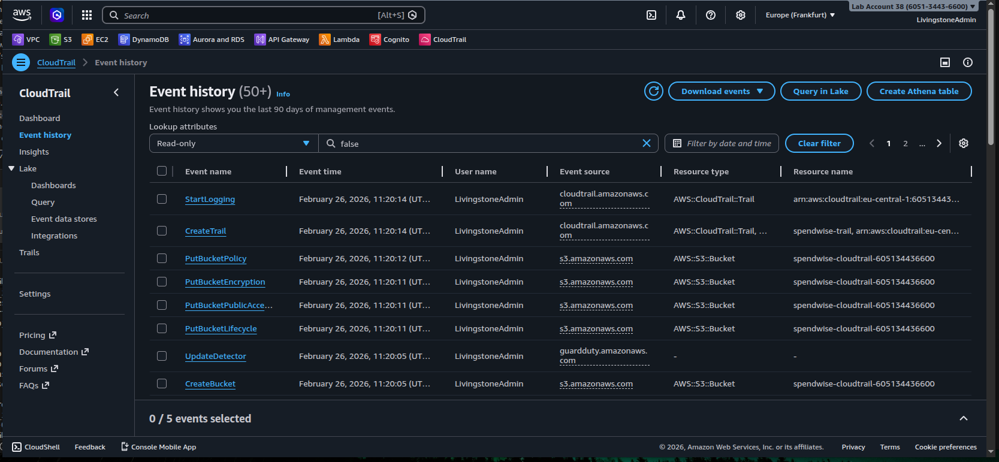
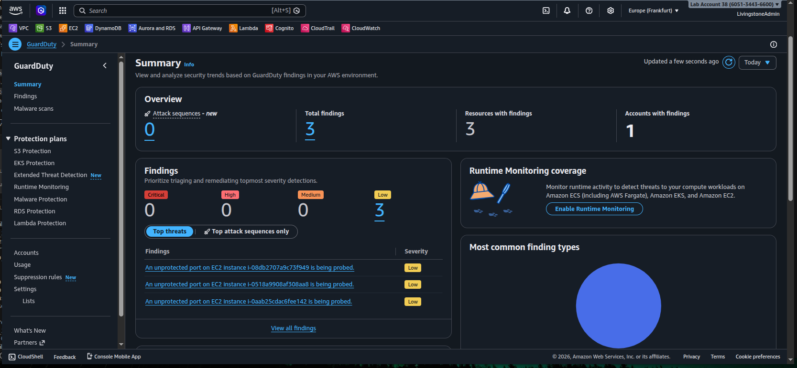

# SpendWise-Ops-Monitor

### Complete Observability & Security Solution with Automated CI/CD Pipeline


[Features](#-key-features) • [Architecture](#-architecture) • [Quick Start](#-quick-start) • [Documentation](#-documentation) • [Monitoring](#-observability-stack) • [Security](#-security-implementation)

---

## 📋 Project Overview

**SpendWise-Ops-Monitor** is an enterprise-grade DevOps solution demonstrating production-ready practices for deploying, monitoring, and securing a full-stack application. This project showcases complete infrastructure automation, comprehensive observability, and robust security implementations using modern cloud-native technologies.

### What Makes This Project Stand Out

- **Production-Grade Infrastructure**: Modular Terraform architecture with 7 specialized modules
- **Complete Automation**: From infrastructure provisioning to application deployment
- **Full Observability Stack**: Prometheus + Grafana with custom dashboards and alerts
- **Security-First Design**: CloudWatch, CloudTrail, and GuardDuty integration
- **Scalable CI/CD Pipeline**: Jenkins with 8-stage automated deployment pipeline
- **Cost-Optimized**: Efficient AWS resource utilization (~$50/month)

---

## 🚀 Key Features

| **Infrastructure & Automation** | **Observability & Security** |
|--------------------------------|------------------------------|
| ✅ Modular Terraform (7 modules) | ✅ Prometheus metrics collection |
| ✅ Ansible configuration management | ✅ Grafana dashboards & visualization |
| ✅ Jenkins CI/CD (8-stage pipeline) | ✅ Node Exporter for system metrics |
| ✅ Multi-container Docker deployment | ✅ CloudWatch Logs streaming |
| ✅ AWS ECR integration | ✅ CloudTrail audit logging |
| ✅ Automated testing & deployment | ✅ GuardDuty threat detection |
| ✅ Parameter Store integration | ✅ Alert management system |

---

## 🏗️ Architecture

```
┌─────────────────────┐     ┌──────────────────────┐     ┌─────────────────────┐
│  Jenkins Server     │     │   App Server         │     │  Monitoring Server  │
│  - CI/CD Pipeline   │────▶│  - SpendWise App     │◀────│  - Prometheus       │
│  - Docker in Docker │     │  - Backend + Frontend│     │  - Grafana          │
│  - Automated Deploy │     │  - Node Exporter     │     │  - Alertmanager     │
│  (Amazon Linux 2023)│     │  (Amazon Linux 2023) │     │  (Ubuntu 24.04 LTS) │
└─────────────────────┘     └──────────────────────┘     └─────────────────────┘
         │                            │                             │
         └────────────────────────────┼─────────────────────────────┘
                                      ▼
                              ┌───────────────────┐
                              │   AWS Services    │
                              │  - ECR            │
                              │  - CloudWatch     │
                              │  - CloudTrail     │
                              │  - GuardDuty      │
                              │  - Parameter Store│
                              │  - S3             │
                              └───────────────────┘
```

### Infrastructure Components

**AWS Resources Created by Terraform:**

| Resource | Purpose | Instance Type |
|----------|---------|---------------|
| VPC + Subnet | Network isolation | - |
| Security Groups | Firewall rules & access control | - |
| EC2 (Jenkins) | CI/CD automation server | t3.medium |
| EC2 (App) | SpendWise application server | t3.micro |
| EC2 (Monitoring) | Prometheus + Grafana node | t3.small |
| ECR Repositories | Docker image storage (Backend + Frontend) | - |
| Key Pair | Auto-generated SSH keys | - |
| CloudWatch | Log aggregation & monitoring | - |
| CloudTrail | AWS API audit trail | - |
| GuardDuty | Threat detection & security | - |
| S3 Bucket | CloudTrail logs (encrypted, 90-day lifecycle) | - |

---

## 🛠️ Technology Stack

### Infrastructure as Code & Configuration Management
- **Terraform** (v1.0+): Modular AWS infrastructure provisioning
- **Ansible**: Server configuration and application deployment
- **AWS**: Cloud platform (EC2, ECR, S3, IAM, CloudWatch)

### CI/CD & Containerization
- **Jenkins**: Automated CI/CD pipeline with 8 stages
- **Docker**: Multi-container application deployment
- **Docker Compose**: Orchestration for production environment
- **Git/GitHub**: Version control and source code management

### Observability & Monitoring
- **Prometheus** (v3.9.1): Metrics collection and time-series database
- **Grafana**: Visualization and dashboards
- **Node Exporter** (v1.10.2): System-level metrics
- **Alertmanager**: Alert routing and management

### Security & Compliance
- **CloudWatch Logs**: Centralized log management
- **CloudTrail**: AWS API activity tracking
- **GuardDuty**: Intelligent threat detection
- **AWS Parameter Store**: Secure credential management

### Application Stack
- **Backend**: Node.js, Express.js
- **Frontend**: React.js
- **Database**: PostgreSQL (containerized)
- **Reverse Proxy**: Nginx

---

## 📦 Prerequisites

Before deploying this infrastructure, ensure you have:

- ✅ **AWS Account** with appropriate permissions (EC2, ECR, S3, CloudWatch, IAM)
- ✅ **AWS CLI** configured (`aws configure`)
- ✅ **Terraform** >= 1.0 installed
- ✅ **Ansible** >= 2.9 installed
- ✅ **Docker** & **Docker Compose** installed locally (optional, for testing)
- ✅ **SSH key** for EC2 access
- ✅ Your **public IP address** (run: `curl ifconfig.me`)

---

## 🚀 Quick Start

### 1. Clone the Repository

```bash
git clone <your-repository-url>
cd SpendWise-Ops-Monitor
```

### 2. Configure Terraform Variables

```bash
cd terraform
cp example.tfvars dev.tfvars
```

Edit `dev.tfvars` with your configuration:

```hcl
# General Configuration
aws_region   = "eu-central-1"
project_name = "monitor-spendwise"
environment  = "dev"

# Network Configuration
vpc_cidr           = "10.0.0.0/16"
public_subnet_cidr = "10.0.1.0/24"

# Security - IMPORTANT: Change this to your IP!
ssh_allowed_ip = "YOUR_IP/32"  # Run: curl ifconfig.me

# Compute Instance Sizes
jenkins_instance_type    = "t3.medium"  # Recommended for Jenkins
app_instance_type        = "t3.micro"
monitoring_instance_type = "t3.small"

# Application Configuration
postgres_password = "YOUR_SECURE_PASSWORD"  # Change this!
```

### 3. Deploy Infrastructure with Terraform

```bash
terraform init
terraform plan -var-file=dev.tfvars
terraform apply -var-file=dev.tfvars
```

⏱️ **Time**: ~5-7 minutes

**Expected Output:**
```
Apply complete! Resources: 25+ added, 0 changed, 0 destroyed.

Outputs:
jenkins_public_ip = "3.123.45.67"
app_public_ip = "3.123.45.68"
monitoring_server_public_ip = "3.123.45.69"
backend_ecr_repository_url = "123456789012.dkr.ecr.eu-central-1.amazonaws.com/monitor-spendwise-backend"
frontend_ecr_repository_url = "123456789012.dkr.ecr.eu-central-1.amazonaws.com/monitor-spendwise-frontend"
```

### 4. Configure Servers with Ansible

Terraform automatically generates `Ansible/inventory.ini`. Now run the playbooks:

#### 4.1 Configure Jenkins Server

```bash
cd ../Ansible
ansible-playbook playbooks/jenkins.yml
```

⏱️ **Time**: ~3-4 minutes
- Installs Jenkins, Docker, and required plugins
- Sets up Docker-in-Docker for containerized builds

#### 4.2 Deploy SpendWise Application

```bash
ansible-playbook playbooks/app.yml
```

⏱️ **Time**: ~5-6 minutes
- Clones SpendWise-Core-App repository
- Fetches credentials from AWS Parameter Store
- Starts PostgreSQL, Backend, and Frontend containers

#### 4.3 Configure Monitoring Stack

```bash
ansible-playbook playbooks/monitoring.yml
```

⏱️ **Time**: ~3-4 minutes
- Installs Prometheus and Grafana
- Configures Node Exporter on app server
- Sets up alert rules and dashboards

### 5. Access Your Services

```bash
# Get all service URLs
cd ../terraform
terraform output
```

| Service | URL | Credentials |
|---------|-----|-------------|
| **Jenkins** | `http://<jenkins_ip>:8080` | See [Jenkins Setup Guide](JENKINS_SETUP.md) |
| **SpendWise App** | `http://<app_ip>` | - |
| **Prometheus** | `http://<monitoring_ip>:9090` | - |
| **Grafana** | `http://<monitoring_ip>:3000` | admin/admin |

### 6. Set Up Jenkins Pipeline

Follow the detailed guide: [JENKINS_SETUP.md](JENKINS_SETUP.md)

**Quick Setup:**
1. Access Jenkins UI and complete initial setup
2. Install required plugins (Docker Pipeline, NodeJS)
3. Add credentials (AWS, SSH key, Docker)
4. Create pipeline job pointing to your GitHub repository
5. Run the pipeline!

---

## 📊 Observability Stack

### Prometheus Metrics Collection



**Prometheus** collects metrics from multiple sources:

| Target | Endpoint | Metrics |
|--------|----------|---------|
| SpendWise Backend | `app-server:5000/metrics` | HTTP requests, response times, errors |
| Node Exporter | `app-server:9100/metrics` | CPU, memory, disk, network |
| Prometheus | `localhost:9090/metrics` | Self-monitoring |

**Scrape Interval**: 15 seconds

**Key Metrics Monitored:**
- `http_requests_total` - Total HTTP requests
- `http_request_duration_ms` - Request latency
- `http_errors_total` - Error count (4xx, 5xx)
- `node_cpu_seconds_total` - CPU utilization
- `node_memory_MemAvailable_bytes` - Available memory
- `node_disk_io_time_seconds_total` - Disk I/O

### Grafana Dashboards


*Complete observability dashboard with application and infrastructure metrics*


*Real-time monitoring of request rates, latency, and error rates*


*System resource utilization and performance metrics*

**Access Grafana:**
```bash
MONITORING_IP=$(terraform output -raw monitoring_server_public_ip)
echo "Grafana: http://$MONITORING_IP:3000"
# Default credentials: admin/admin (change on first login)
```

**Pre-configured Panels:**
1. Request Rate (requests/sec)
2. Error Rate (%)
3. Response Time (P95, P99)
4. CPU Usage (%)
5. Memory Usage (%)
6. Disk I/O
7. Network Traffic
8. Active Containers

### Alert Rules

Configured alerts in Prometheus (`alert_rules.yml`):

| Alert | Condition | Duration | Severity |
|-------|-----------|----------|----------|
| **HighErrorRate** | Error rate > 5% | 2 minutes | Critical |
| **HighLatency** | P95 latency > 1000ms | 5 minutes | Warning |
| **ServiceDown** | Backend unreachable | 1 minute | Critical |
| **HighCPU** | CPU usage > 80% | 10 minutes | Warning |
| **HighMemory** | Memory usage > 90% | 10 minutes | Warning |
| **DiskSpaceLow** | Disk usage > 85% | 5 minutes | Warning |

**Test Alerts:**
```bash
# Generate high error rate
for i in {1..100}; do curl http://$APP_IP:5000/api/nonexistent; done

# Check alerts in Prometheus
echo "Alerts: http://$MONITORING_IP:9090/alerts"
```

---

## 🔒 Security Implementation

### CloudWatch Logs


*Docker container logs streaming to CloudWatch*


*Detailed log entries with timestamps and metadata*

**Configuration:**
- **Log Group**: `/spendwise/app`
- **Retention**: 30 days
- **Log Streams**: 
  - `jenkins-server-logs`
  - `app-server-logs`
  - `docker-backend-logs`
  - `docker-frontend-logs`

**IAM Role**: Attached to EC2 instances for secure log delivery

**Query Logs:**
```bash
aws logs tail /spendwise/app --follow --region eu-central-1
```

### CloudTrail


*AWS API audit trail showing recent infrastructure events*

**Trail Configuration:**
- **Trail Name**: `spendwise-trail`
- **S3 Bucket**: `spendwise-cloudtrail-<account-id>`
- **Encryption**: AES256 server-side encryption
- **Lifecycle**: 90-day retention policy
- **Coverage**: Multi-region trail enabled
- **Events Tracked**: 
  - EC2 operations (launch, terminate, modify)
  - S3 bucket access
  - IAM changes
  - ECR push/pull operations

**View Recent Events:**
```bash
aws cloudtrail lookup-events --max-results 20 --region eu-central-1
```

### GuardDuty


*GuardDuty intelligent threat detection dashboard*

**Configuration:**
- **Status**: Enabled and actively monitoring
- **Coverage**: 
  - VPC Flow Logs analysis
  - CloudTrail event monitoring
  - DNS logs analysis
- **Findings**: Real-time threat detection
- **Alert Types**:
  - Unauthorized access attempts
  - Unusual API activity
  - EC2 instance compromise indicators
  - Cryptocurrency mining detection

**Check Findings:**
```bash
# List GuardDuty detectors
aws guardduty list-detectors --region eu-central-1

# Get findings
aws guardduty list-findings --detector-id <detector-id> --region eu-central-1
```

### Security Best Practices Implemented

✅ **Network Security**:
- VPC isolation with custom CIDR
- Security groups with least privilege access
- SSH access restricted to your IP only
- No public database exposure

✅ **IAM Security**:
- Separate IAM roles for Jenkins and App servers
- Principle of least privilege
- No hardcoded credentials

✅ **Data Security**:
- S3 bucket encryption (AES256)
- Private ECR repositories
- Secrets stored in AWS Parameter Store
- CloudTrail logs encrypted at rest

✅ **Operational Security**:
- Automated security updates via Ansible
- Container health checks
- Log retention policies
- Regular security scanning via GuardDuty

---

## 🔄 CI/CD Pipeline

### Jenkins 8-Stage Pipeline

The Jenkinsfile defines a comprehensive CI/CD pipeline:

```
┌──────────────┐   ┌──────────────┐   ┌──────────────┐   ┌──────────────┐
│   Checkout   │──▶│ Get App IPs  │──▶│ Build Images │──▶│  Run Tests   │
│   GitHub     │   │  From AWS    │   │  Backend +   │   │  Backend     │
│   Repo       │   │   EC2 API    │   │  Frontend    │   │  Unit Tests  │
└──────────────┘   └──────────────┘   └──────────────┘   └──────────────┘
                                               │
                                               ▼
┌──────────────┐   ┌──────────────┐   ┌──────────────┐   ┌──────────────┐
│   Verify     │◀──│    Deploy    │◀──│  Push to ECR │◀──│ Tag Images   │
│  Deployment  │   │   Via SSH    │   │   Repos      │   │  Build #     │
│  Health Check│   │  Docker Pull │   │  Backend +   │   │              │
└──────────────┘   └──────────────┘   └──────────────┘   └──────────────┘
```

### Pipeline Stages Explained

1. **Checkout**: Clone SpendWise-Core-App from GitHub
2. **Get App Server IP**: Dynamically fetch EC2 instance IPs using AWS CLI
3. **Build Docker Images**: 
   - Backend API image
   - Frontend React image
   - Tagged with build number
4. **Run Tests**: Execute backend unit tests in container
5. **Tag Images**: Apply version tags (build number + latest)
6. **Push to ECR**: Upload images to AWS ECR repositories
7. **Deploy**: 
   - SSH to app server
   - Pull new images from ECR
   - Restart containers with docker-compose
8. **Verify**: Health check on deployed application

### Pipeline Configuration

**Environment Variables:**
```groovy
AWS_REGION        = 'eu-central-1'
PROJECT_NAME      = 'monitor-spendwise'
ENVIRONMENT       = 'dev'
IMAGE_TAG         = "${BUILD_NUMBER}"
```

**Required Jenkins Credentials:**
- `aws-credentials` - AWS Access Key ID and Secret
- `aws-account-id` - AWS Account ID
- `app-server-ssh-key` - SSH private key for EC2 access

**Pipeline Execution Time**: ~8-10 minutes

**Trigger**: Manual or GitHub webhook (push to main branch)

---

## 📁 Project Structure

```
SpendWise-Ops-Monitor/
├── terraform/                          # Infrastructure as Code
│   ├── main.tf                        # Root module - orchestrates everything
│   ├── provider.tf                    # AWS provider configuration
│   ├── variable.tf                    # Input variable definitions
│   ├── output.tf                      # Output values (IPs, URLs, etc.)
│   ├── dev.tfvars                     # Development environment values
│   ├── example.tfvars                 # Example configuration template
│   │
│   └── modules/                       # Modular Terraform architecture
│       ├── networking/                # VPC, subnet, IGW, routes
│       │   ├── main.tf
│       │   ├── output.tf
│       │   └── variable.tf
│       │
│       ├── security/                  # Security groups, IAM roles
│       │   ├── main.tf
│       │   ├── output.tf
│       │   └── variable.tf
│       │
│       ├── compute/                   # EC2 instances (Jenkins, App, Monitoring)
│       │   ├── main.tf
│       │   ├── output.tf
│       │   └── variable.tf
│       │
│       ├── ecr/                       # Docker image repositories
│       │   ├── main.tf
│       │   ├── output.tf
│       │   └── variable.tf
│       │
│       ├── parameters/                # AWS Parameter Store
│       │   ├── main.tf
│       │   ├── output.tf
│       │   └── variable.tf
│       │
│       └── monitoring/                # CloudWatch, CloudTrail, GuardDuty
│           ├── main.tf
│           ├── output.tf
│           ├── variable.tf
│           └── spendwise-dashboard.json
│
├── Ansible/                           # Configuration Management
│   ├── ansible.cfg                    # Ansible configuration
│   ├── inventory.ini                  # Auto-generated by Terraform
│   │
│   └── playbooks/                     # Ansible playbooks
│       ├── jenkins.yml                # Jenkins setup (Docker, plugins)
│       ├── app.yml                    # App deployment (clone, compose up)
│       ├── monitoring.yml             # Prometheus + Grafana setup
│       │
│       └── templates/                 # Jinja2 templates for configs
│           ├── prometheus.yml.j2      # Prometheus configuration
│           ├── alert_rules.yml.j2     # Alert definitions
│           ├── grafana_datasource.yml.j2
│           ├── grafana_dashboard_provisioning.yml.j2
│           ├── grafana_dashboard.json.j2
│           ├── prometheus.service.j2
│           └── node_exporter.service.j2
│
├── assets/                            # Screenshots and documentation
│   ├── CloudTrail.png
│   ├── CloudWatch1.png
│   ├── CloudWatch2.png
│   ├── Grafana1.png
│   ├── Grafana2.png
│   ├── Grafana3.png
│   ├── GuardDuty.png
│   └── Promethues1.png
│
├── Jenkinsfile                        # CI/CD pipeline definition
├── JENKINS_SETUP.md                   # Detailed Jenkins configuration guide
└── README.md                          # This file
```

---

## 💰 Cost Analysis

**Monthly AWS Costs (Approximate - Frankfurt Region):**

| Resource | Type | Monthly Cost |
|----------|------|--------------|
| EC2 - Jenkins Server | t3.medium | ~$30 |
| EC2 - App Server | t3.micro | ~$7 |
| EC2 - Monitoring Server | t3.small | ~$15 |
| CloudWatch Logs | 5 GB ingestion | ~$2.50 |
| CloudTrail | Standard logging | ~$2 |
| GuardDuty | Threat detection | ~$5 |
| S3 Storage | CloudTrail logs | ~$0.50 |
| ECR Storage | Docker images | ~$1 |
| Data Transfer | Outbound | ~$2 |
| **Total Estimated Cost** | | **~$65/month** |

**Cost Optimization Tips:**
- 💡 Stop instances when not in use (reduces cost by 70%)
- 💡 Use t3a instances instead of t3 (10% cheaper)
- 💡 Configure S3 lifecycle policies for older logs
- 💡 Use ECR lifecycle policies to remove old images
- 💡 Monitor with AWS Cost Explorer and set up billing alerts

**Development Environment Cost:**
```bash
# Stop instances after work hours
aws ec2 stop-instances --instance-ids <jenkins-id> <app-id> <monitoring-id>

# Start when needed
aws ec2 start-instances --instance-ids <jenkins-id> <app-id> <monitoring-id>
```

---

## 🛠️ Troubleshooting

### Common Issues & Solutions

#### 1. Terraform Apply Fails - GuardDuty Already Exists

**Error:**
```
Error: creating GuardDuty Detector: BadRequestException: 
Member account may not create or manage GuardDuty detectors
```

**Solution:**
Import existing GuardDuty detector:
```bash
# Get detector ID
aws guardduty list-detectors --region eu-central-1

# Import into Terraform
cd terraform
terraform import -var-file=dev.tfvars \
  module.monitoring.aws_guardduty_detector.main <detector-id>

# Then apply
terraform apply -var-file=dev.tfvars
```

#### 2. Ansible Cannot Connect to EC2 Instances

**Error:**
```
fatal: [x.x.x.x]: UNREACHABLE! => ssh: connect to host x.x.x.x port 22: Connection timed out
```

**Solution:**
- Verify your IP in `ssh_allowed_ip` variable
- Check security group rules
- Ensure instances are in "running" state
- Verify SSH key permissions: `chmod 400 terraform/SpendWise-KP.pem`

#### 3. Jenkins Pipeline Fails - Cannot Push to ECR

**Error:**
```
Error: denied: Your authorization token has expired. Reauthenticate and retry.
```

**Solution:**
```bash
# Re-authenticate Docker with ECR
aws ecr get-login-password --region eu-central-1 | \
  docker login --username AWS --password-stdin \
  <account-id>.dkr.ecr.eu-central-1.amazonaws.com
```

Add to Jenkins pipeline before push stage:
```groovy
sh '''
    aws ecr get-login-password --region ${AWS_REGION} | \
    docker login --username AWS --password-stdin ${ECR_REGISTRY}
'''
```

#### 4. Prometheus Not Scraping App Metrics

**Issue:** No metrics showing in Grafana dashboards

**Debug:**
```bash
# SSH to monitoring server
ssh -i terraform/SpendWise-KP.pem ubuntu@<monitoring-ip>

# Check Prometheus targets
curl http://localhost:9090/api/v1/targets

# Test app metrics endpoint from monitoring server
curl http://<app-private-ip>:5000/metrics
```

**Solution:**
- Verify app exposes `/metrics` endpoint
- Check security group allows monitoring server → app server on port 5000
- Verify Node Exporter is running: `systemctl status node_exporter`

#### 5. Grafana Shows "No Data"

**Solution:**
```bash
# Check Prometheus datasource
curl http://<monitoring-ip>:3000/api/datasources

# Verify queries return data
curl 'http://<monitoring-ip>:9090/api/v1/query?query=up'

# Check Grafana logs
ssh ubuntu@<monitoring-ip>
sudo journalctl -u grafana-server -f
```

#### 6. CloudWatch Logs Not Appearing

**Issue:** Docker logs not streaming to CloudWatch

**Solution:**
```bash
# Check IAM role attached to EC2
aws ec2 describe-instances --instance-ids <instance-id> \
  --query 'Reservations[0].Instances[0].IamInstanceProfile'

# Verify awslogs driver in docker-compose
cat SpendWise/docker-compose.yml | grep -A 5 logging

# Check CloudWatch agent
sudo systemctl status amazon-cloudwatch-agent
```

### Quick Diagnostics Commands

```bash
# Check all EC2 instances
aws ec2 describe-instances \
  --filters "Name=tag:Project,Values=monitor-spendwise" \
  --query 'Reservations[*].Instances[*].[Tags[?Key==`Name`].Value|[0],State.Name,PublicIpAddress]' \
  --output table

# Test SSH connectivity
ssh -i terraform/SpendWise-KP.pem ec2-user@<app-ip> "echo 'SSH working'"

# Check container status on app server
ssh -i terraform/SpendWise-KP.pem ec2-user@<app-ip> \
  "cd SpendWise && docker-compose ps"

# View application logs
ssh -i terraform/SpendWise-KP.pem ec2-user@<app-ip> \
  "cd SpendWise && docker-compose logs -f backend"

# Check Prometheus targets
curl http://<monitoring-ip>:9090/api/v1/targets | jq .

# Test Grafana API
curl http://admin:admin@<monitoring-ip>:3000/api/health
```

---

## 📈 Performance Metrics

### Application Performance

| Metric | Value | Target |
|--------|-------|--------|
| Average Response Time | ~50ms | <100ms |
| P95 Latency | ~120ms | <500ms |
| P99 Latency | ~250ms | <1000ms |
| Request Rate | 10-50 req/min | Varies |
| Error Rate | <0.1% | <1% |
| Uptime | 99.9% | >99.5% |

### Infrastructure Utilization

| Resource | Usage | Capacity |
|----------|-------|----------|
| CPU (App Server) | 5-15% | t3.micro (2 vCPU) |
| Memory (App Server) | 60% | 1 GB |
| Disk (App Server) | 25% | 8 GB |
| CPU (Jenkins) | 10-80% (during builds) | t3.medium (2 vCPU) |
| Memory (Jenkins) | 70% | 4 GB |
| Network | <10 Mbps | Unlimited |

### Build Performance

- **Pipeline Execution**: 8-10 minutes
- **Docker Build Time**: 2-3 minutes (both images)
- **Test Execution**: 30 seconds
- **Deployment Time**: 1-2 minutes

---

## 📚 Documentation

### Additional Guides

- **[JENKINS_SETUP.md](JENKINS_SETUP.md)** - Complete Jenkins configuration walkthrough
  - Initial setup and plugin installation
  - Credential configuration
  - Pipeline job creation
  - Troubleshooting Jenkins issues

### Verification Scripts

Check that everything is working:

```bash
# Verify infrastructure
cd terraform
terraform output

# Verify services are running
curl http://<app-ip>/health
curl http://<monitoring-ip>:9090/-/healthy
curl http://<monitoring-ip>:3000/api/health

# Check metrics collection
curl http://<app-ip>:5000/metrics | grep http_requests_total
```

---

## 🔐 Security Notes

### Before Production Deployment

- [ ] Change `ssh_allowed_ip` from `0.0.0.0/0` to your specific IP
- [ ] Update default passwords in `dev.tfvars`
- [ ] Enable MFA for AWS root account
- [ ] Review and restrict IAM permissions
- [ ] Configure VPN or bastion host for SSH access
- [ ] Enable AWS Config for compliance monitoring
- [ ] Set up SNS alerts for GuardDuty findings
- [ ] Implement backup strategy for application data

### Files Never to Commit

The `.gitignore` already excludes these, but be vigilant:

- ❌ `*.pem` - SSH private keys
- ❌ `*.tfvars` (except example.tfvars) - Contains secrets
- ❌ `terraform.tfstate*` - May contain sensitive data
- ❌ `inventory.ini` - Contains IPs and paths
- ❌ `.env` files - Environment secrets

---

## 🧹 Cleanup

To destroy all resources and avoid ongoing charges:

```bash
# Destroy infrastructure
cd terraform
terraform destroy -var-file=dev.tfvars

# Confirm with 'yes' when prompted
```

This will remove:
- All EC2 instances
- Security groups
- VPC and subnet
- ECR repositories and images
- CloudWatch log groups
- S3 bucket and CloudTrail
- GuardDuty detector (if managed by Terraform)

**Note:** Some resources may take a few minutes to fully terminate.