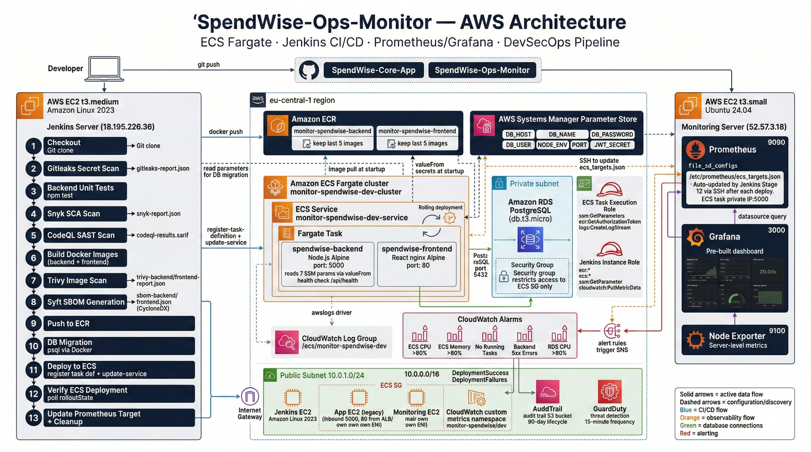

# SpendWise Secure CI/CD Pipeline

### DevSecOps Pipeline with SAST · SCA · Secret Scanning · Image Scanning · SBOM · Blue/Green ECS Deployment


[Overview](#project-overview) • [Architecture](#architecture) • [Pipeline Stages](#pipeline-stages) • [Blue/Green Deployment](#bluegreen-deployment-with-aws-codedeploy) • [Security Gates](#security-gates) • [Prerequisites](#prerequisites) • [Setup](#setup) • [Deliverables](#deliverables)

---

## Project Overview

This project implements a **production-grade Secure CI/CD Pipeline** for the SpendWise full-stack web application. Every commit triggers an automated 13-stage Jenkins pipeline that builds, security-scans, and deploys the application to **AWS ECS Fargate** using **CodeDeploy blue/green deployment** — with hard pipeline blocks on any HIGH or CRITICAL security finding.

### What This Pipeline Delivers

| Capability | Implementation |
|---|---|
| **Secret Detection** | Gitleaks — blocks on any credential/key found in source |
| **Dependency Scanning (SCA)** | Snyk — blocks on HIGH/CRITICAL in production deps |
| **Static Analysis (SAST)** | CodeQL — blocks on HIGH/CRITICAL JavaScript findings |
| **Container Image Scanning** | Trivy — blocks on HIGH/CRITICAL fixable CVEs |
| **Software Bill of Materials** | Syft/CycloneDX JSON for backend and frontend images |
| **Versioned Image Registry** | AWS ECR with `BUILD_NUMBER` + `latest` tags |
| **ECS Fargate Deployment** | Rolling deploy with task definition revision management |
| **Blue/Green Deployment** | CodeDeploy ECS blue/green with ALB traffic shifting |
| **Observability** | CloudWatch logs + 7 alarms + Container Insights |
| **Infrastructure as Code** | Modular Terraform (9 modules) |

---

## Architecture


*AWS infrastructure architecture — Jenkins → ECR → ECS Fargate → RDS*

```
┌──────────────────────────────────────────────────────────────────────┐
│                        Jenkins CI/CD Server                          │
│                    (EC2 · Amazon Linux 2023)                         │
│                                                                      │
│  ┌────────┐ ┌──────────┐ ┌─────────┐ ┌────────┐ ┌────────────────┐ │
│  │Gitleaks│ │  Snyk    │ │ CodeQL  │ │ Trivy  │ │  Syft / SBOM   │ │
│  │Secret  │ │  SCA     │ │  SAST   │ │ Image  │ │  CycloneDX     │ │
│  │Scan    │ │ Dep Scan │ │ JS Scan │ │ Scan   │ │  JSON          │ │
│  └────────┘ └──────────┘ └─────────┘ └────────┘ └────────────────┘ │
└────────────────────────────┬─────────────────────────────────────────┘
                             │ Push images + Register task def
                             ▼
┌───────────────────────────────────────────────────────────────────────┐
│                              AWS Cloud (eu-central-1)                 │
│                                                                       │
│  ┌──────────────────┐    ┌────────────────────────────────────────┐  │
│  │   Amazon ECR     │    │         AWS ECS Fargate                │  │
│  │                  │    │                                        │  │
│  │  ├─ backend:N    │───▶│  Task Definition (rev N)               │  │
│  │  ├─ backend:lat  │    │  ├─ spendwise-backend  (Node.js/ESM)   │  │
│  │  ├─ frontend:N   │    │  └─ spendwise-frontend (React/Nginx)   │  │
│  │  └─ frontend:lat │    │                                        │  │
│  │  Lifecycle:      │    │  Rolling deploy + Circuit Breaker      │  │
│  │  keep last 5     │    │  CloudWatch Logs (awslogs driver)      │  │
│  └──────────────────┘    └────────────────────────────────────────┘  │
│                                         │                             │
│  ┌──────────────────────────────────────▼───────────────────────┐    │
│  │  AWS SSM Parameter Store                                     │    │
│  │  /monitor-spendwise/dev/db/name · db/user · db/password      │    │
│  │  /monitor-spendwise/dev/app/db_host · app ports · jwt_secret │    │
│  └──────────────────────────────────────────────────────────────┘    │
│                                                                       │
│  ┌─────────────────────────┐   ┌──────────────────────────────────┐  │
│  │  Amazon RDS (PostgreSQL)│   │  CloudWatch                      │  │
│  │  spendwise database     │   │  Log Group: /ecs/monitor-spend.. │  │
│  └─────────────────────────┘   │  7 Alarms · Container Insights   │  │
│                                └──────────────────────────────────┘  │
└───────────────────────────────────────────────────────────────────────┘
```

---

## Pipeline Stages

The Jenkinsfile defines **13 stages** that run sequentially. Any security-gate failure immediately blocks and fails the build.

| # | Stage | Tool | Description | Blocks On |
|---|-------|------|-------------|-----------|
| 1 | **Checkout** | Git | Clone SpendWise-Core-App from GitHub; create `security-reports/` dir | — |
| 2 | **Secret Scan** | Gitleaks | Scan repo for hardcoded credentials, API keys, tokens | Any secret found |
| 3 | **Backend Tests** | npm/Jest | Run backend unit test suite in workspace | Test failure |
| 4 | **SCA Scan** | Snyk | Scan production Node.js dependencies for known CVEs | HIGH/CRITICAL CVE |
| 5 | **SAST Scan** | CodeQL | Build JS CodeQL database; run `javascript-security-extended` | ERROR-level finding |
| 6 | **Build Images** | Docker | Build backend and frontend images tagged with `BUILD_NUMBER` + `latest` | Build failure |
| 7 | **Image Scan** | Trivy | Scan both images for fixable HIGH/CRITICAL OS + app CVEs | HIGH/CRITICAL fixable CVE |
| 8 | **Generate SBOM** | Syft | CycloneDX JSON SBOM for both images; archived as artifacts | — |
| 9 | **Push to ECR** | AWS CLI | ECR login; push `BUILD_NUMBER` and `latest` tags for both repos | Push failure |
| 9b | **DB Migration** | psql | Run `init.sql` against RDS via postgres container; idempotent | Migration error |
| 10 | **Deploy to ECS** | CodeDeploy | Blue/green deploy: Register new task def → Upload appspec.yml to S3 → Create CodeDeploy deployment | Pre-flight fail / deployment creation error |
| 11 | **Verify ECS** | AWS CLI | Poll CodeDeploy deployment status until Succeeded (12 min timeout) | Deployment failed/stopped (auto-rollback) |
| 12 | **Update Prometheus** | Ansible | Re-configure Prometheus `scrape_configs` with new ECS target IP | — |
| 13 | **Cleanup** | Docker | `docker system prune` — remove dangling images and cache | — |

### Pipeline Run Evidence

**Successful Pipeline Build:**


*Pipeline stages — all 13 stages green*


*Build completion overview*


*Stage timing and build details*

**Security Gate Blocking (Pipeline Failure):**


*Pipeline blocked — HIGH/CRITICAL vulnerability detected, build aborted*


*Failure detail — stage that triggered the security block*

### Stage 10 — ECS Deploy Detail

```
Pre-flight checks
  ├─ Verify 4 SSM parameters exist (db_host, db/name, db/user, db/password)
  └─ Verify ECR images exist at tag BUILD_NUMBER

Render new task definition
  ├─ Fetch current task def JSON from ECS
  ├─ Patch container image tags (backend + frontend → :BUILD_NUMBER)
  ├─ Strip AWS-managed fields (revision, requiresAttributes, etc.)
  └─ Register as new revision → archive as security-reports/task-definition-rendered.json

Update service
  └─ aws ecs update-service --force-new-deployment --task-definition FAMILY:NEW_REVISION

Circuit breaker: if rollout fails, ECS auto-rolls back — Jenkins diagnoses:
  ├─ Stopped task stop reason + exit codes
  ├─ Last 30 CloudWatch log lines from /ecs/monitor-spendwise-dev
  └─ Last 5 ECS service events
```

### ECS Deployment Evidence

**Cluster & Service Overview:**


*ECS cluster with running service and task count*

**Deployment in Progress:**


*ECS service rolling deployment — new revision being rolled out*


*Deployment completing — desired task count reached*


*ECS deployment status confirmation*

**Task Definition Revision:**


*New task definition revision registered with updated image tags*

**ECS Service Events:**


*ECS service events tab — deployment lifecycle events*

**ECS Log Streams (CloudWatch):**


*CloudWatch log streams for ECS containers*

---

## Blue/Green Deployment with AWS CodeDeploy

The pipeline implements **zero-downtime blue/green deployment** using AWS CodeDeploy for ECS. This advanced deployment strategy creates a new "green" environment with the updated application version, shifts traffic from the old "blue" environment via ALB listener manipulation, and automatically rolls back on failure.

### What is Blue/Green Deployment?

Blue/green deployment is a release strategy that reduces downtime and risk by running two identical production environments:

- **Blue** = Currently running production environment serving live traffic
- **Green** = New environment with the updated application version

During deployment:
1. The green environment is provisioned with the new task definition
2. Health checks validate the green environment via a test listener (port 8080)
3. Production traffic (port 80) is shifted from blue to green
4. After successful verification, blue tasks are terminated (5-minute wait)
5. If any step fails, CodeDeploy automatically rolls back to blue

### Architecture Components

| Component | Purpose |
|---|---|
| **CodeDeploy Application** | ECS compute platform application |
| **Deployment Group** | Defines deployment configuration and targets |
| **Target Groups** (Blue/Green) | ALB target groups for active and standby tasks |
| **Production Listener** (Port 80) | Receives live user traffic |
| **Test Listener** (Port 8080) | Used by CodeDeploy for health checks before traffic shift |
| **AppSpec File** | Deployment manifest specifying task definition and network config |
| **S3 Bucket** | Stores versioned appspec.yml files for each build |

### Deployment Configuration

```yaml
# Blue/Green Deployment Settings
Deployment Config: CodeDeployDefault.ECSAllAtOnce
  - Shifts 100% traffic immediately after health checks pass
  - Use ECSLinear10PercentEvery1Minutes for gradual canary deployments in production

Traffic Control:
  - Production Listener: Port 80 → Shifts from blue to green
  - Test Listener: Port 8080 → Pre-shift validation

Auto-Rollback: Enabled
  - Triggers on: DEPLOYMENT_FAILURE
  - Action: Revert traffic to blue target group

Blue Task Termination:
  - Wait time: 5 minutes after successful traffic shift
  - Allows time for in-flight requests to complete
```

### Pipeline Integration

#### Stage 10: Deploy to ECS (with CodeDeploy)

The deployment process is fully automated in Stage 10:

```bash
# 1. Pre-flight checks
├─ Verify SSM parameters exist (db credentials, app config)
├─ Verify ECR images exist at BUILD_NUMBER tag
└─ Read CodeDeploy config from SSM (app name, deployment group, S3 bucket)

# 2. Task definition management
├─ Fetch current ECS task definition
├─ Patch container image tags to :BUILD_NUMBER
├─ Strip AWS-managed fields (revision, ARN, timestamps)
└─ Register new task definition revision

# 3. AppSpec preparation
├─ Render appspec.yml with new task definition ARN
├─ Include subnet and security group configuration
└─ Upload to S3: s3://BUCKET/TASK_FAMILY/BUILD_NUMBER/appspec.yml

# 4. Trigger blue/green deployment
├─ aws deploy create-deployment
├─ Reference S3 appspec location
└─ Save deployment ID for Stage 11 verification
```

**Key Code Snippet** ([pipeline/stages/10_deploy_to_ecs.sh](pipeline/stages/10_deploy_to_ecs.sh)):

```bash
# Create CodeDeploy blue/green deployment
DEPLOYMENT_ID=$(aws deploy create-deployment \
    --region "${AWS_REGION}" \
    --application-name "${CODEDEPLOY_APP}" \
    --deployment-group-name "${CODEDEPLOY_DG}" \
    --revision "revisionType=S3,s3Location={bucket=${APPSPEC_BUCKET},key=${APPSPEC_S3_KEY},bundleType=YAML}" \
    --description "Jenkins build ${IMAGE_TAG} — task def revision ${NEW_REVISION}" \
    --query 'deploymentId' \
    --output text)
```

#### Stage 11: Verify ECS Deployment

Stage 11 polls the CodeDeploy deployment status until completion:

```bash
# Deployment lifecycle stages
Created → Queued → InProgress → Ready → Succeeded
                               ↓
                       (on failure) → Failed/Stopped (auto-rollback)

# Polling behavior
├─ Check status every 15 seconds
├─ Max attempts: 48 (12-minute timeout)
├─ Terminal states:
│  ├─ Succeeded ✅ → Pipeline continues
│  └─ Failed/Stopped ❌ → Pipeline fails with diagnostics
└─ Ready state = traffic shifted, waiting for blue termination timer
```

### AppSpec File Structure

The [appspec.yml](appspec.yml) template used by CodeDeploy:

```yaml
version: 0.0
Resources:
  - TargetService:
      Type: AWS::ECS::Service
      Properties:
        TaskDefinition: "arn:aws:ecs:REGION:ACCOUNT:task-definition/FAMILY:REVISION"
        LoadBalancerInfo:
          ContainerName: "spendwise-backend"
          ContainerPort: 5000
        PlatformVersion: LATEST
        NetworkConfiguration:
          AwsvpcConfiguration:
            Subnets:
              - subnet-xxxxx
              - subnet-yyyyy
            SecurityGroups:
              - sg-xxxxx
            AssignPublicIp: ENABLED
```

The pipeline renders this template in Stage 10 by:
1. Replacing `TaskDefinition` with the newly registered task definition ARN
2. Populating `Subnets` and `SecurityGroups` from the running ECS service
3. Uploading to S3 at a versioned key: `TASK_FAMILY/BUILD_NUMBER/appspec.yml`

### Terraform Module

The CodeDeploy infrastructure is defined in [terraform/codedeploy/](terraform/codedeploy/):

```terraform
terraform/codedeploy/
├── main.tf         # CodeDeploy app, deployment group, S3 bucket, IAM roles
├── output.tf       # Outputs: app name, deployment group, S3 bucket
└── variable.tf     # Input variables: cluster, service, target groups, listeners
```

**Key Resources:**

| Resource | Description |
|---|---|
| `aws_codedeploy_app` | ECS application (compute platform = ECS) |
| `aws_codedeploy_deployment_group` | Blue/green deployment group with ALB target group pairs |
| `aws_s3_bucket` | Stores appspec.yml revisions (versioned, encrypted) |
| `aws_iam_role` | CodeDeploy service role with ECS blue/green permissions |
| `aws_ssm_parameter` | SSM parameters for pipeline config (app name, S3 bucket, deployment group) |

**Terraform Integration** ([terraform/main.tf](terraform/main.tf)):

```terraform
module "codedeploy" {
  source = "./codedeploy"

  project_name      = var.project_name
  environment       = var.environment
  
  ecs_cluster_name  = module.ecs.cluster_name
  ecs_service_name  = module.ecs.service_name
  
  blue_tg_name      = module.networking.blue_tg_name
  green_tg_name     = module.networking.green_tg_name
  prod_listener_arn = module.networking.prod_listener_arn
  test_listener_arn = module.networking.test_listener_arn
  
  depends_on = [module.ecs]
}
```

### Benefits of Blue/Green Deployment

✅ **Zero Downtime** — Traffic shift is instantaneous; users never experience service interruption

✅ **Instant Rollback** — CodeDeploy automatically reverts to blue on any failure

✅ **Pre-Production Validation** — Test listener (port 8080) allows health checks before production traffic shift

✅ **Deployment History** — S3 stores all appspec.yml revisions; CloudTrail logs deployment events

✅ **Infrastructure as Code** — Entire deployment pipeline defined in Terraform

✅ **Circuit Breaker** — ECS deployment circuit breaker provides additional failure protection

### Observability & Troubleshooting

**CloudWatch Logs:**
- ECS task logs: `/ecs/monitor-spendwise-dev`
- CodeDeploy deployment events via CloudTrail

**Deployment Monitoring:**
```bash
# View deployment status
aws deploy get-deployment --deployment-id d-XXXXXXXXX

# List recent deployments
aws deploy list-deployments \
  --application-name monitor-spendwise-dev-codedeploy-app \
  --deployment-group-name monitor-spendwise-dev-dg

# Check S3 appspec history
aws s3 ls s3://BUCKET/monitor-spendwise-dev-task/ --recursive
```

**Common Issues:**

| Issue | Cause | Resolution |
|---|---|---|
| Deployment stuck in InProgress | Health check failing on test listener | Check CloudWatch logs for container startup errors |
| Failed health check | Container not listening on port 5000 | Verify backend service starts correctly; check security group rules |
| Automatic rollback | Green tasks failing ECS health checks | Review task stop reason in ECS console; check resource limits (CPU/memory) |
| S3 access denied | IAM permissions missing | Verify CodeDeploy role has `s3:GetObject` on appspec bucket |

**AWS Console Links:**

After deployment, view details at:
```
CodeDeploy: https://eu-central-1.console.aws.amazon.com/codesuite/codedeploy/deployments/DEPLOYMENT_ID
ECS Service: https://eu-central-1.console.aws.amazon.com/ecs/home?region=eu-central-1#/clusters/CLUSTER/services/SERVICE
```

---

## Security Gates

### How Each Gate Blocks the Pipeline

| Tool | Exit Code Semantics | Block Condition |
|------|--------------------|-----------------------|
| **Gitleaks** | `0` = clean · `1` = secrets found | Any non-zero exit |
| **Snyk** | `0` = clean · `1` = HIGH/CRITICAL · `2` = scan error | Exit 1 or 2 |
| **CodeQL** | SARIF parsed — count of `"level": "error"` results | Count > 0 |
| **Trivy** | `0` = clean · `1` = HIGH/CRITICAL fixable found | Any non-zero exit from either image scan |

All scan reports are archived as build artifacts regardless of pass/fail:

```
security-reports/
├── gitleaks-report.json          # Secret scan — Gitleaks JSON
├── snyk-report.json              # SCA — Snyk JSON
├── snyk-stderr.log               # Snyk progress/error log (split from JSON)
├── codeql-results.sarif          # SAST — CodeQL SARIF
├── trivy-backend-report.json     # Image scan — backend
├── trivy-frontend-report.json    # Image scan — frontend
├── sbom-backend.json             # SBOM — Syft CycloneDX JSON
├── sbom-frontend.json            # SBOM — Syft CycloneDX JSON
├── task-definition-rendered.json # ECS task def registered this build
└── codedeploy_deployment_id.txt  # CodeDeploy deployment ID for Stage 11
```

**Archived Build Artifacts in Jenkins:**


*Security reports archived as build artifacts — accessible per build*


*Artifact listing showing all scan reports and SBOM files*

### Testing the Security Gates (Assignment Requirement 8)

To verify the Snyk gate blocks on vulnerable dependencies:

```bash
# 1. In SpendWise-Core-App/backend/package.json, add:
"lodash": "4.17.15"

# 2. Run npm install in backend/, commit and push
# 3. Trigger the pipeline — Stage 4 (SCA Scan) will FAIL with:
#    ❌ Snyk found HIGH/CRITICAL vulnerabilities — blocking pipeline
#    [HIGH] SNYK-JS-LODASH-... in lodash@4.17.15

# 4. Remove the vulnerable dep, commit, and push → pipeline passes
```

---

## Infrastructure (Terraform)

The `terraform/` directory uses **8 Terraform modules**:

```
terraform/
├── main.tf               # Root — wires all modules together
├── provider.tf           # AWS provider (eu-central-1)
├── variable.tf           # Input variables
├── output.tf             # Outputs (ECR URLs, cluster name, etc.)
├── dev.tfvars            # Development environment values
└── modules/
    ├── networking/       # VPC, subnets, IGW, route tables
    ├── security/         # Security groups, IAM roles (Jenkins + ECS)
    ├── compute/          # EC2 Jenkins server (t3.medium)
    ├── ecr/              # Two ECR repos + lifecycle policy (keep last 5)
    ├── ecs/              # ECS Fargate cluster + service + task definition
    ├── rds/              # PostgreSQL RDS instance
    ├── parameters/       # SSM Parameter Store (7 parameters)
    └── monitoring/       # CloudWatch log group + 7 alarms + CloudTrail + GuardDuty
```

### ECR Lifecycle Policy

Each repository is configured to:
- Keep the last **5 tagged images**
- Expire **untagged images** after **1 day**

**ECR Repositories:**


*ECR repositories — backend and frontend image registries*


*Versioned image tags in ECR (BUILD_NUMBER + latest)*

**Lifecycle Policy Configuration:**


*ECR lifecycle policy — keep last 5 tagged, expire untagged after 1 day*

### CloudWatch Monitoring

| Alarm | Metric | Threshold |
|-------|--------|-----------|
| High CPU | `ECS/CPUUtilization` | > 80% for 5 min |
| High Memory | `ECS/MemoryUtilization` | > 80% for 5 min |
| Running Tasks | `ECS/RunningTaskCount` | < 1 for 1 min |
| 5xx Errors | App logs (metric filter) | > 10 in 5 min |
| DB CPU | `RDS/CPUUtilization` | > 80% for 5 min |
| DB Connections | `RDS/DatabaseConnections` | > 100 |
| ECS Service Events | CloudTrail | Deployment events |

**CloudWatch Log Groups & Streams:**


*CloudWatch log group for ECS containers*


*CloudWatch log streams — one per ECS task*


*CloudWatch metrics and alarms dashboard*


*CloudWatch alarm states — ECS CPU, memory, and task count alarms*


*Live log stream contents from running ECS container*

---

## Prerequisites

| Requirement | Purpose |
|---|---|
| AWS account (`eu-central-1`) | Cloud infrastructure |
| AWS CLI configured | Terraform + Jenkins AWS operations |
| Terraform >= 1.0 | Infrastructure provisioning |
| Jenkins (EC2, Amazon Linux 2023) | Pipeline execution |
| Docker | Image builds and tool containers |
| CodeQL CLI at `/opt/codeql-cli/codeql/` | SAST scanning (install on Jenkins server) |
| Snyk account + API token | SCA scanning |
| PostgreSQL client (via Docker) | DB migration |

---

## Setup

### 1. Provision Infrastructure

```bash
cd terraform
cp example.tfvars dev.tfvars
# Edit dev.tfvars — set your IP, postgres password, etc.
terraform init
terraform plan -var-file=dev.tfvars
terraform apply -var-file=dev.tfvars
```

Key outputs after apply:
```
jenkins_public_ip            = "<ip>"
backend_ecr_repository_url   = "605134436600.dkr.ecr.eu-central-1.amazonaws.com/monitor-spendwise-backend"
frontend_ecr_repository_url  = "605134436600.dkr.ecr.eu-central-1.amazonaws.com/monitor-spendwise-frontend"
ecs_cluster_name             = "monitor-spendwise-dev-cluster"
```

### 2. Install CodeQL CLI on Jenkins Server

```bash
ssh ec2-user@<jenkins_ip>
sudo mkdir -p /opt/codeql-cli
cd /opt/codeql-cli
# Download the CodeQL bundle for Linux from:
# https://github.com/github/codeql-action/releases
sudo wget https://github.com/github/codeql-action/releases/download/codeql-bundle-v2.x.x/codeql-bundle-linux64.tar.gz
sudo tar -xzf codeql-bundle-linux64.tar.gz
# Verify:
/opt/codeql-cli/codeql/codeql --version
```

### 3. Configure Jenkins Credentials

Go to **Manage Jenkins → Credentials** and add:

| Credential ID | Type | Contents |
|---|---|---|
| `aws-credentials` | AWS Credentials | AWS Access Key ID + Secret Access Key |
| `aws-account-id` | Secret Text | Your 12-digit AWS Account ID |
| `snyk-token` | Secret Text | Snyk API token (from snyk.io account settings) |

### 4. Create Jenkins Pipeline Job

1. New Item → Pipeline
2. Pipeline → Pipeline script from SCM
3. SCM: Git → `https://github.com/KofiAckah/Secure-CI-CD-Pipeline.git`
4. Script Path: `Jenkinsfile`
5. Save → Build Now

### 5. SSM Parameters

The pipeline reads these parameters at deploy time. Terraform creates them; verify with:

```bash
aws ssm get-parameters-by-path \
  --path "/monitor-spendwise/dev" \
  --recursive \
  --region eu-central-1 \
  --query 'Parameters[*].Name'
```

Expected parameters:
- `/monitor-spendwise/dev/db/name`
- `/monitor-spendwise/dev/db/user`
- `/monitor-spendwise/dev/db/password`
- `/monitor-spendwise/dev/app/db_host`
- `/monitor-spendwise/dev/app/backend_port`
- `/monitor-spendwise/dev/app/db_port`
- `/monitor-spendwise/dev/app/frontend_port`

---

## Repositories

| Repository | URL | Contents |
|---|---|---|
| **Pipeline repo** (this repo) | `https://github.com/KofiAckah/Secure-CI-CD-Pipeline.git` | Jenkinsfile, Terraform, Ansible |
| **Application repo** | `https://github.com/KofiAckah/SpendWise-Core-App.git` | Node.js backend, React frontend, Dockerfiles |

---

## Deliverables Checklist

All 9 assignment requirements are met:

| # | Requirement | Status | Evidence |
|---|---|---|---|
| 1 | App from previous project with tests + Dockerfile; images stored in ECR | ✅ | Stages 3, 6, 9 — ECR repos in `terraform/ecr/` |
| 2 | SAST (CodeQL), SCA (Snyk), image scan (Trivy), secret scan (Gitleaks), SBOM (Syft/CycloneDX) | ✅ | Stages 2, 4, 5, 7, 8 |
| 3 | Pipeline fails on HIGH/CRITICAL vulns or secrets; all reports archived | ✅ | Security gate logic in each scan stage; `archiveArtifacts` in `post.always` |
| 4 | Build and push versioned image tags (`BUILD_NUMBER` + `latest`) to ECR | ✅ | Stage 9 — `docker push :${IMAGE_TAG}` + `:latest` |
| 5 | Render and register new ECS task definition revision with new image tag | ✅ | SCodeDeploy blue/green deployment with ALB traffic shifting + auto-rollback
| 6 | Update ECS service with rolling deploy + force-new-deployment | ✅ | Stage 10 — `aws ecs update-service --force-new-deployment` with circuit breaker |
| 7 | CloudWatch logs via `awslogs` driver; alarms; custom deployment metrics | ✅ | `awslogs` in task def · `terraform/monitoring/` · Stage 11 verify |
| 8 | Manual test: inject `lodash@4.17.15` → Snyk blocks; remove → passes | ⚠️ | See [Testing the Security Gates](#testing-the-security-gates-assignment-requirement-8) |
| 9 | ECR lifecycle policy + ECS task definition revision cleanup (keep last 3) | ✅ | `terraform/ecr/main.tf` lifecycle rules · Stage 10 deregisters old revisions |

### Build Artifacts (per build)

Each successful (or failed-at-scan) build archives:

```
security-reports/
├── gitleaks-report.json
├── snyk-report.json
├── snyk-stderr.log
├── codeql-results.sarif
├── trivy-backend-report.json
├── trivy-frontend-report.json
├── sbom-backend.json              ← CycloneDX JSON
├── sbom-frontend.json             ← CycloneDX JSON
├── task-definition-rendered.json  ← ECS task def registered this build
└── codedeploy_deployment_id.txt   ← CodeDeploy deployment ID
```

---

## Project Structure

```
SpendWise-Ops-Monitor/
├── appspec.yml                        # CodeDeploy ECS blue/green deployment manifest (template)
├── JENKINS_SETUP.md                   # Jenkins server setup guide
├── README.md                          # This file
├── README-monitoring.md               # Previous project (Prometheus/Grafana observability)
│
├── terraform/                         # Infrastructure as Code (9 modules)
│   ├── main.tf
│   ├── provider.tf
│   ├── variable.tf
│   ├── output.tf
│   ├── dev.tfvars
│   ├── example.tfvars
│   ├── networking/                    # VPC, subnets, routing, ALB with blue/green target groups
│   ├── security/                      # IAM roles, security groups
│   ├── compute/                       # Jenkins EC2 instance
│   ├── ecr/                           # ECR repos + lifecycle policy
│   ├── ecs/                           # ECS cluster, service, task definition
│   ├── rds/                           # PostgreSQL RDS
│   ├── parameters/                    # SSM Parameter Store
│   ├── codedeploy/                    # CodeDeploy app, deployment group, S3 bucket, IAM roles
│   └── monitoring/                    # CloudWatch log group + 7 alarms + CloudTrail + GuardDuty
│
└── pipeline/                          # Pipeline stage scripts
    └── stages/
        ├── 01_checkout.sh
        ├── 02_secret_scan.sh
        ├── 03_backend_tests.sh
        ├── 04_sca_scan.sh
        ├── 05_sast_codeql.sh
        ├── 06_build_images.sh
        ├── 07_image_scan.sh
        ├── 08_generate_sbom.sh
        ├── 09_push_to_ecr.sh
        ├── 09b_db_migration.sh
        ├── 10_deploy_to_ecs.sh        # CodeDeploy blue/green deployment
        ├── 11_verify_ecs.sh           # Poll CodeDeploy deployment status
        ├── 12_update_prometheus.sh
        └── 13_cleanup.sh
```
│   ├── parameters/                    # SSM Parameter Store
│   └── monitoring/                    # CloudWatch alarms, CloudTrail, GuardDuty
│
└── Ansible/                           # Server configuration
    ├── ansible.cfg
    ├── inventory.ini
    └── playbooks/
        ├── jenkins.yml
        ├── app.yml
        ├── monitoring.yml
        └── templates/
            ├── prometheus.yml.j2
            ├── alert_rules.yml.j2
            └── ...
```

---

## Environment Variables (Jenkins Pipeline)

```groovy
AWS_REGION        = 'eu-central-1'
PROJECT_NAME      = 'monitor-spendwise'
ENVIRONMENT       = 'dev'
IMAGE_TAG         = "${env.BUILD_NUMBER}"      // increments per build
ECS_CLUSTER       = 'monitor-spendwise-dev-cluster'
ECS_SERVICE       = 'monitor-spendwise-dev-service'
TASK_FAMILY       = 'monitor-spendwise-dev-task'
BACKEND_ECR_REPO  = '<account>.dkr.ecr.eu-central-1.amazonaws.com/monitor-spendwise-backend'
FRONTEND_ECR_REPO = '<account>.dkr.ecr.eu-central-1.amazonaws.com/monitor-spendwise-frontend'
REPORTS_DIR       = 'security-reports'
```

---

## Troubleshooting

### ECS Task Fails to Start

Stage 10 automatically diagnoses failures. Common causes:

| Error | Cause | Fix |
|---|---|---|
| `ResourceInitializationError` | SSM parameter missing or wrong path | Check SSM parameter names match `/monitor-spendwise/dev/...` |
| `CannotPullContainerError` | ECR image tag not found | Verify Stage 9 (Push to ECR) completed successfully |
| `SyntaxError: Cannot use import statement` | `package.json` missing from Docker image | Ensure `COPY package.json .` is in `backend/Dockerfile` |
| ECS service stuck in 0/1 running | Container exits immediately | Check CloudWatch logs at `/ecs/monitor-spendwise-dev` |

### CodeDeploy Deployment Failures

Common CodeDeploy blue/green deployment issues:

| Issue | Cause | Fix |
|---|---|---|
| Deployment stuck at InProgress | Health check failing on test listener (port 8080) | Check CloudWatch logs for container startup errors; verify security group allows port 8080 |
| Failed after traffic shift | Green tasks failing ECS health checks | Review task stop reason in ECS console; check resource limits (CPU/memory) |
| Auto-rollback triggered | CodeDeploy detected failure during deployment | Check deployment events in CodeDeploy console; review CloudWatch logs for errors |
| S3 access denied | IAM permissions missing on appspec bucket | Verify CodeDeploy service role has `s3:GetObject` on S3 bucket |
| Invalid appspec.yml | Syntax error or missing required fields | Check rendered appspec in `security-reports/`; validate YAML syntax |

```bash
# View deployment details
aws deploy get-deployment --deployment-id d-XXXXXXXXX --region eu-central-1

# Check deployment error information
aws deploy get-deployment \
  --deployment-id d-XXXXXXXXX \
  --region eu-central-1 \
  --query 'deploymentInfo.errorInformation'

# View CodeDeploy console for detailed logs
echo "https://eu-central-1.console.aws.amazon.com/codesuite/codedeploy/deployments/d-XXXXXXXXX"
```

### Snyk Authentication Fails

```bash
# Verify token is valid
snyk auth <token>
# Re-add credential in Jenkins:
# Manage Jenkins → Credentials → snyk-token
```

### CodeQL Database Creation Fails

```bash
# Check CodeQL CLI is at the expected path
/opt/codeql-cli/codeql/codeql --version
# Ensure the Jenkins user has read access to source files
ls -la /var/lib/jenkins/workspace/<job-name>/SpendWise-Core-App/backend
```
